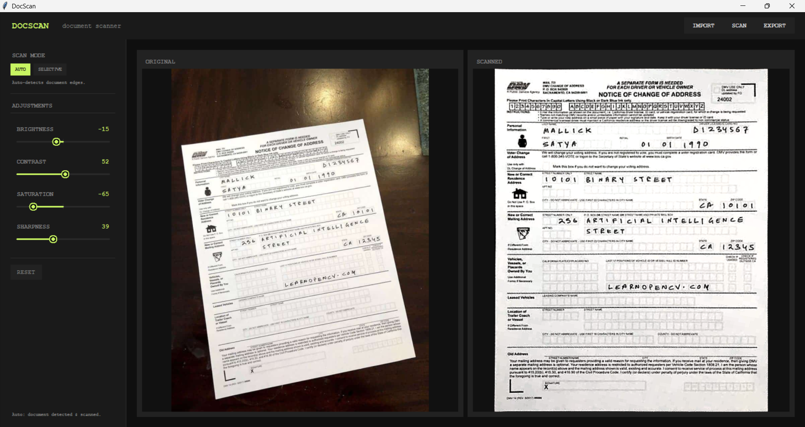
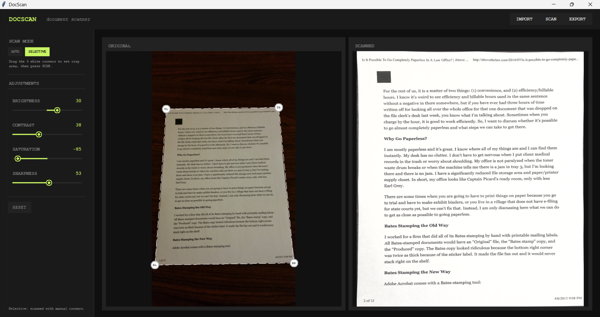

# Document Scanner

This project is designed to address the problem of needing to scan documents without a scanner.

## Get Started

1. install uv.

        pip install uv

2. clone this project and install dependencies.

        git clone https://github.com/worapon-st/document-scanner
        uv sync

3. run the program

        uv run main.py

## Example

1. Automation scanned mode.

2. Edge selection scanned mode.

